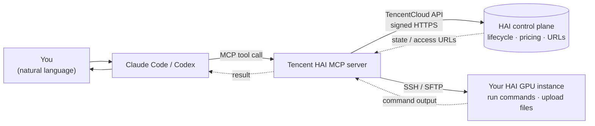

# Tencent HAI MCP

> Operate **Tencent Cloud HAI** (High-Performance Application Service) straight from **Claude Code** or **Codex** — in plain language. Spin up a GPU box, deploy your own app, grab the access URL, and shut it down to stop billing, all without touching the console.

[](https://www.python.org/)
[](https://modelcontextprotocol.io/)
[](LICENSE)

---

## 简介 (TL;DR)

每次用腾讯云 HAI 都要登录控制台、点来点去、跑命令、用完还得记得关机？这个 MCP 把这些都交给 Claude：

- 「帮我看看我的 HAI 机器还开着吗」→ 列出实例和状态
- 「把我的 app 部署上去」→ 自动开机 → 跑你的部署命令 → 返回访问网址
- 「用完了，关掉别扣钱」→ 关机（保留数据）
- 「给我那台机器的 JupyterLab 网址」→ 直接把带 token 的链接递给你

It wraps the official Tencent Cloud HAI API plus SSH-based remote execution as a set of well-described [MCP](https://modelcontextprotocol.io/) tools.

---

## How it works



Two planes, one server:

| Plane | Transport | What it does |
| --- | --- | --- |
| **Control plane** | TencentCloud HAI API (TC3 signed) | discover templates, price, create / start / stop / terminate instances, read web access URLs |
| **Data plane** | SSH / SFTP | run shell commands, upload files, one-shot **deploy your own app** |

---

## Features

- 🔎 **Discovery** — list regions, scenes, and application templates (Stable Diffusion, ChatGLM, ComfyUI, …)
- 💵 **Pricing** — estimate cost *before* you create anything
- 🚀 **Lifecycle** — create, start, stop, terminate instances (cost/destruction actions are flagged with MCP `destructiveHint`)
- 🔗 **Access** — fetch ready-to-open JupyterLab / WebUI URLs (token embedded) and network/IP info
- 🛠️ **Remote execution** — run commands, upload files, and `hai_deploy` your own app in one shot over SSH
- 🔐 **Safe by construction** — credentials only ever come from environment variables; nothing is hardcoded or logged

---

## Prerequisites

1. A **Tencent Cloud** account with **HAI** enabled.
2. An **API key** (SecretId / SecretKey) — create one at the [CAM console](https://console.cloud.tencent.com/cam/capi).
3. **Python 3.10+**.
4. *(Only for the remote-execution / deploy tools)* SSH access to your instance — a key file or password. See [Enabling SSH](#enabling-ssh-for-remote-tools).

---

## Installation

```bash
git clone https://github.com/SuperGokou/tecentHAIMCP.git
cd tecentHAIMCP
pip install -e .
```

This installs the `hai-mcp` command (the MCP entry point).

---

## Configuration

All configuration is via environment variables. Copy `.env.example` to `.env` for local development, or set them in your MCP client's `env` block.

| Variable | Required | Default | Description |
| --- | --- | --- | --- |
| `TENCENTCLOUD_SECRET_ID` | ✅ | — | Tencent Cloud API SecretId |
| `TENCENTCLOUD_SECRET_KEY` | ✅ | — | Tencent Cloud API SecretKey |
| `HAI_REGION` | — | `ap-guangzhou` | Default region (e.g. `ap-shanghai`, `ap-singapore`) |
| `HAI_SSH_USER` | — | `ubuntu` | SSH user on the instance (remote tools) |
| `HAI_SSH_PORT` | — | `22` | SSH port (remote tools) |
| `HAI_SSH_KEY_PATH` | — | — | Path to a private key file (remote tools) |
| `HAI_SSH_PASSWORD` | — | — | SSH password — provide this **or** a key (remote tools) |
| `HAI_SSH_KNOWN_HOSTS` | — | — | known_hosts file to verify host keys; unset = auto-accept new keys |

> The control-plane tools work with just the two credential variables. The `HAI_SSH_*` variables are only needed for `hai_run_command`, `hai_upload_file`, and `hai_deploy`.

---

## Connect it to your client

### Claude Code

One-liner:

```bash
claude mcp add tencent-hai \
  --env TENCENTCLOUD_SECRET_ID=your-id \
  --env TENCENTCLOUD_SECRET_KEY=your-key \
  --env HAI_REGION=ap-guangzhou \
  -- hai-mcp
```

Or add it to your `.mcp.json` / Claude config:

```json
{
  "mcpServers": {
    "tencent-hai": {
      "command": "hai-mcp",
      "env": {
        "TENCENTCLOUD_SECRET_ID": "your-id",
        "TENCENTCLOUD_SECRET_KEY": "your-key",
        "HAI_REGION": "ap-guangzhou",
        "HAI_SSH_USER": "ubuntu",
        "HAI_SSH_KEY_PATH": "/home/you/.ssh/hai_key"
      }
    }
  }
}
```

### Codex

Add to `~/.codex/config.toml`:

```toml
[mcp_servers.tencent-hai]
command = "hai-mcp"
args = []
env = { TENCENTCLOUD_SECRET_ID = "your-id", TENCENTCLOUD_SECRET_KEY = "your-key", HAI_REGION = "ap-guangzhou" }
```

> Not installed as a script? Use `command = "python"`, `args = ["-m", "hai_mcp"]` from the project directory instead.

---

## Usage examples

Once connected, just talk to your assistant. It picks the right tools.

**Check what you have**
> 「列出我所有的 HAI 实例和状态」
> → `hai_list_instances`

**Deploy your own app (the main workflow)**
> 「把 ins-xxxx 上的 app 部署一下：先 `cd ~/app && git pull`，再 `bash start.sh`，然后给我访问网址」
> → `hai_deploy(instance_id="ins-xxxx", commands=["cd ~/app && git pull", "bash start.sh"])`
> This powers the instance on if needed, runs your steps in order, and returns the web URL.

**Launch a prebuilt template**
> 「开一台 Stable Diffusion 的机器，先告诉我多少钱」
> → `hai_list_applications` → `hai_inquire_price` → `hai_create_instance` → `hai_get_login_url`

**Stop paying**
> 「用完了，把 ins-xxxx 关掉」
> → `hai_stop_instance` (keeps your data, stops compute billing)

**Get the web link**
> 「给我 ins-xxxx 的 JupyterLab 地址」
> → `hai_get_login_url`

---

## Tool reference

| Tool | Group | Annotation | Description |
| --- | --- | --- | --- |
| `hai_list_regions` | Discovery | read-only | Regions where HAI is available |
| `hai_list_scenes` | Discovery | read-only | Application scene categories |
| `hai_list_applications` | Discovery | read-only | Deployable application templates |
| `hai_inquire_price` | Pricing | read-only | Estimate instance cost before creating |
| `hai_list_instances` | Lifecycle | read-only | Your instances + status + IPs |
| `hai_create_instance` | Lifecycle | **destructive** (costs money) | Launch instance(s) from a template |
| `hai_start_instance` | Lifecycle | idempotent write | Power on |
| `hai_stop_instance` | Lifecycle | idempotent write | Power off (stop billing, keep data) |
| `hai_terminate_instances` | Lifecycle | **destructive** (data loss) | Permanently destroy instance(s) |
| `hai_get_login_url` | Access | read-only | JupyterLab / WebUI URLs (token embedded) |
| `hai_get_network` | Access | read-only | Public IP, bandwidth, traffic usage |
| `hai_run_command` | Remote | write | Run a shell command over SSH |
| `hai_upload_file` | Remote | write | Upload a file over SFTP |
| `hai_deploy` | Remote | write | One-shot: ensure running → run steps → return URL |

---

## Enabling SSH for remote tools

The control-plane tools need nothing extra. For `hai_run_command` / `hai_upload_file` / `hai_deploy`, the server logs into your instance over SSH on your behalf, so it needs a credential:

1. Make sure your instance has a **public IP** (HAI instances do by default).
2. Set a password or add your public key to the instance (you can do this once via the HAI web terminal / JupyterLab).
3. Point the server at the credential with `HAI_SSH_KEY_PATH` (recommended) or `HAI_SSH_PASSWORD`, and set `HAI_SSH_USER` if it isn't `ubuntu`.

You never have to open a terminal yourself — that's the point.

---

## Security

- **No secrets in code.** Credentials are read only from environment variables; `.env` is gitignored.
- **Least privilege.** Give the API key only the HAI permissions it needs in CAM.
- **Destructive actions are labelled.** `hai_create_instance` (cost) and `hai_terminate_instances` (data loss) carry the MCP `destructiveHint` so clients can prompt before running them.
- **Secrets stay out of logs.** `Config` redacts its credential fields from `repr`, and SSH errors never echo raw server banners.
- **Upload safety.** `hai_upload_file` refuses to read from sensitive local directories (`~/.ssh`, `~/.aws`, `~/.gnupg`, …) to blunt prompt-injection exfiltration.
- **Host keys.** SSH auto-accepts new host keys by default (convenient for fresh instances). Set `HAI_SSH_KNOWN_HOSTS` to a known_hosts file to enforce verification on untrusted networks.

---

## Development

```bash
pip install -e ".[dev]"
pytest                       # run the unit tests
python -m py_compile src/hai_mcp/*.py src/hai_mcp/tools/*.py
```

Project layout:

```
src/hai_mcp/
  server.py        # FastMCP entry point (stdio)
  config.py        # env-driven configuration
  hai_client.py    # authenticated TencentCloud HAI wrapper
  ssh_client.py    # SSH / SFTP helpers (lazy paramiko)
  errors.py        # friendly error translation
  tools/           # discovery · instances · connection · remote
tests/             # unit tests (no network required)
```

---

## Troubleshooting

| Symptom | Fix |
| --- | --- |
| `Missing required environment variable(s)` | Set `TENCENTCLOUD_SECRET_ID` / `TENCENTCLOUD_SECRET_KEY`. |
| `AuthFailure.*` | Wrong key, or the key is disabled — re-check in CAM. |
| `UnauthorizedOperation` | The key lacks HAI permissions — grant the HAI policy. |
| `ResourcesSoldOut` / `ResourceInsufficient` | Try another `BundleType` or region. |
| `No SSH credential configured` | Set `HAI_SSH_KEY_PATH` or `HAI_SSH_PASSWORD`. |
| `... has no public IP yet` | Wait until the instance is `RUNNING`, then retry. |

---

## Roadmap

- [ ] Directory upload / rsync-style sync for large model files
- [ ] Convenience tool: launch a template **and** wait until ready in one call
- [ ] Optional read-only mode (env switch) for shared environments
- [ ] Thin proxy helpers for invoking deployed model services
- [ ] Async tool execution (offload blocking SSH / poll waits off the event loop) — fine for single-user stdio today, matters for multi-client HTTP hosting

---

## License

[MIT](LICENSE) © Ming Xia

> Not affiliated with Tencent Cloud. "HAI" and "Tencent Cloud" are trademarks of their respective owners.
